# Markdown View


[](https://github.com/mapitman/mdview/actions/workflows/build.yml)

A lightweight command-line tool that converts markdown files to styled HTML and opens them in your default browser. Supports GitHub Flavored Markdown, Mermaid diagrams, embedded images, and automatic theme detection.

## Features

- **GitHub Flavored Markdown** - Full support for tables, task lists, strikethrough, and more
- **Mermaid Diagrams** - Create flowcharts, sequence diagrams, state diagrams, and other visualizations directly in markdown
- **Embedded Images** - Automatically converts relative image paths to data URIs for offline viewing
- **Theme Detection** - HTML output conforms to your system's light or dark theme setting
- **Typographic Enhancements** - Smart quotes, dashes, and other typographic improvements
- **Bare HTML Option** - Generate unstyled HTML when needed
- **Flexible Output** - Write to a temporary file or specify a custom output location


## Usage

By default, `mdview` writes the generated HTML to a temporary directory.
It tries these in order:
- A path defined in the `MDVIEW_DIR` environment variable
- Your operating system's temporary directory

If you are on Linux and set the `TMPDIR` environment variable, that is 
what the OS will report as the temp directory. If you set it to a 
directory under your home directory, then browsers installed via Snap 
(like Firefox on Ubuntu) will be able to read the generated file.
Applications installed via Snap are unable to read from `/tmp`.

```text
Usage:
mdview [options] <filename>
Formats markdown and launches it in a browser.
If the environment variable MDVIEW_DIR is set, the temporary file will be written there.
  -b Bare HTML with no style applied.
  -bare
     Bare HTML with no style applied.
  -h Prints mdview help message.
  -help
     Prints mdview help message.
  -o string
     Output filename. (Optional)
  -v Prints mdview version.
  -version
     Prints mdview version.

```

If you do not supply an output file, mdview will write a file to your
operating system's default temp directory or to the value of MDVIEW_DIR.

The generated HTML will conform to your system's light or dark theme
setting, as long as your browser supports that feature.

### Thanks

Thanks to [sindresorhus](https://github.com/sindresorhus/github-markdown-css) for the GitHub style css.

## Installation

### Arch Linux (and derivatives)

Markdown View is available in the [AUR](https://aur.archlinux.org/packages/mdview/)
If you have an AUR helper like `yay`, installing is as easy as:
```
yay -S mdview
```

### Debian Package

If you're running Debian or a derivative like Ubuntu or Pop!_OS, you can
use [deb-get](https://github.com/wimpysworld/deb-get) to install mdview.

```sh
deb-get install mdview
```

If you don't want to use `deb-get`, you can download the package and
manually install it from the
[Releases](https://github.com/mapitman/mdview/releases) page.

```sh
curl -s https://api.github.com/repos/mapitman/mdview/releases/latest \
| grep "browser_download_url.*amd64.deb" \
| cut -d '"' -f 4 \
| xargs curl -L -o mdview_lastest_amd64.deb
sudo dpkg --install mdview_lastest_amd64.deb
```

To remove the package:

```sh
sudo dpkg --remove mdview
```

### Snap Package

_Update: The snap package has been fixed and the latest version is now available as a snap._ 🥳

On Linux, you can install [mdview](https://snapcraft.io/mdview) from the snap store. This option is only viable if the files
you want to view are in your home directory. If you need to view
files in other locations, try an alternate installation method.

_Note_: A side effect of the sandboxing of Snap packages is that every time
`mdview` is executed, Snap will prompt to allow writing
the temporary file. If that is not acceptable, please choose an
alternate installation method.

[](https://snapcraft.io/mdview)

```sh
sudo snap install mdview
```

Don't have snapd?  
[Get set up for snaps](https://docs.snapcraft.io/core/install).

### Manual Download and Install

Grab the correct binary for your operating system
[here](https://github.com/mapitman/mdview/releases/).

### Compile Yourself

If you have Golang installed...
```sh
go get github.com/mapitman/mdview
```

Don't have Golang? [Get it now](https://golang.org/doc/install).

## How It Works

```mermaid
graph TD
    A["📄 Markdown File"] -->|Read| B["Process Images"]
    B -->|Convert<br/>Relative Paths<br/>to Data URIs| C["Image Processing"]
    C --> D["Parse Markdown"]
    D -->|GFM + Mermaid<br/>+ Typography| E["Goldmark Parser"]
    E -->|Generate| F["HTML AST"]
    F -->|Extract Title| G["Extract H1"]
    F -->|Render| H["HTML Content"]
    H -->|Embed<br/>Scripts| I["Add Mermaid.js"]
    I -->|Apply Styles| J["Apply CSS Theme"]
    J -->|Generate| K["HTML File"]
    K -->|Launch| L["🌐 Browser"]
```



